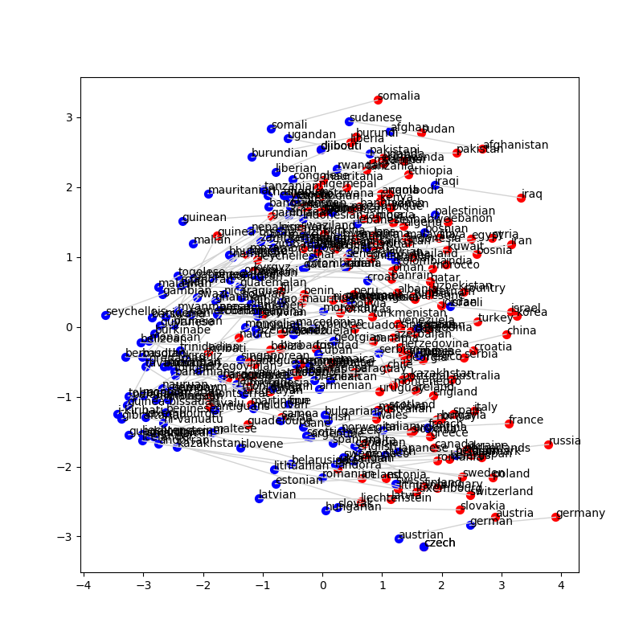
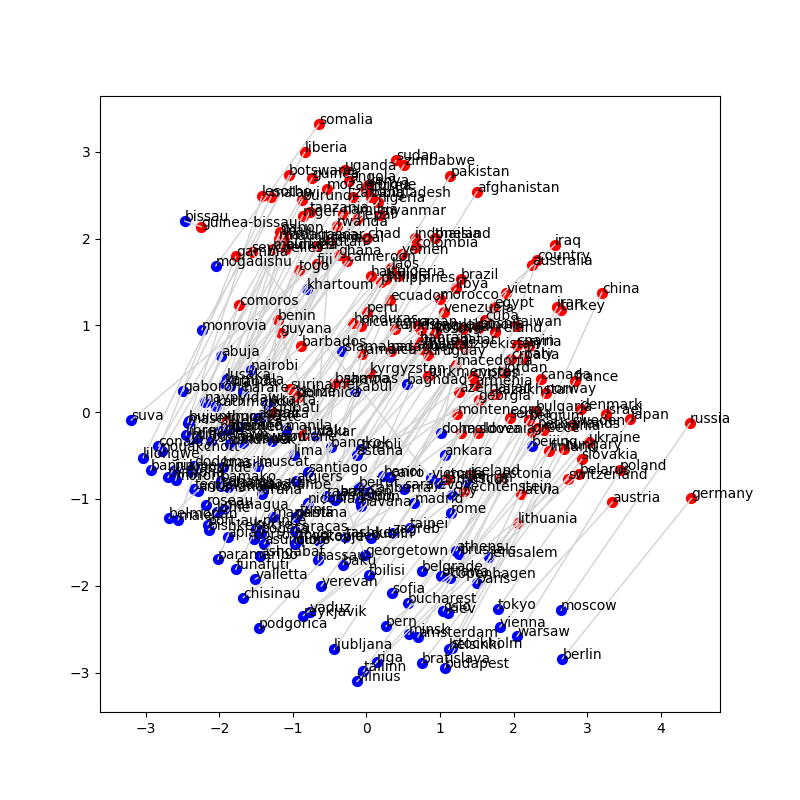
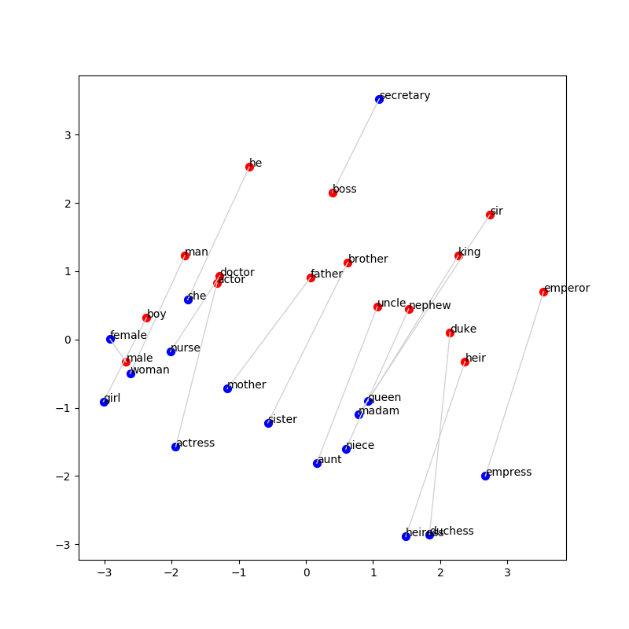
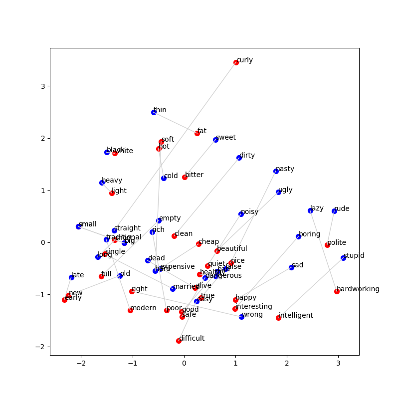
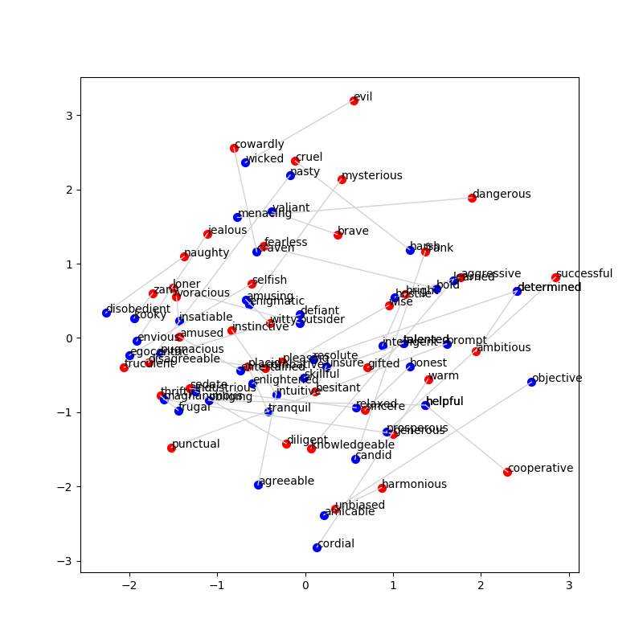
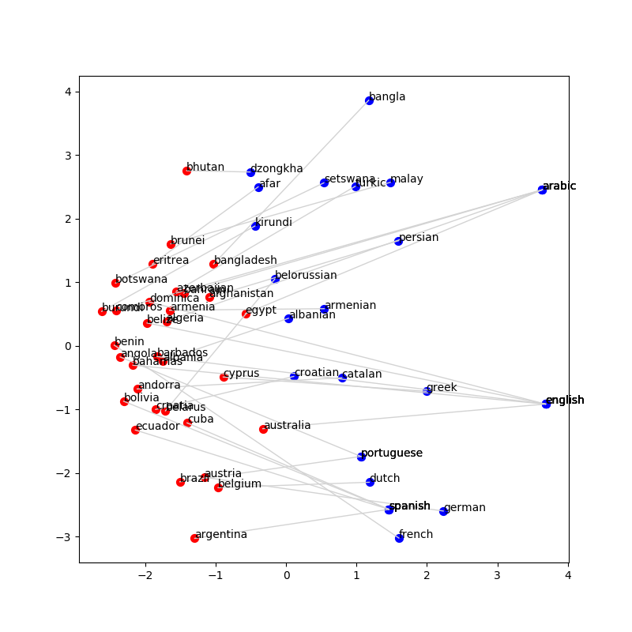

# Lab 03
Chloe Elliott & Madison Hobbs

## 1

1. 
red
[('black', 0.84005837) ('green', 0.85619317) ('blue', 0.8901658 )
 ('yellow', 0.89954593) ]

magenta
[('shading', 0.72655353) ('chartreuse', 0.77450223)
 ('fuchsia', 0.82245993) ('cyan', 0.85664692) ]

flower
[('fruits', 0.72882982) ('tree', 0.7542152 ) ('fruit', 0.79235091)
 ('flowers', 0.84470468) ]

plant
[('produce', 0.7108555 ) ('facility', 0.71149385) ('factory', 0.76381854)
 ('plants', 0.89943982) ]

two
[('six', 0.96413123) ('five', 0.96446624) ('four', 0.98174724)
 ('three', 0.98859015) ]

thousand
[('4,000', 0.88508711) ('1,000', 0.88829444) ('2,000', 0.91303753)
 ('hundred', 0.93100687) ]

one
[('.', 0.91384128) ('same', 0.93508186) ('only', 0.93775686)
 ('another', 0.9515576 ) ]

jupiter
[('orbits', 0.75972645) ('planets', 0.76625521) ('mars', 0.76670823)
 ('orbiting', 0.77354187) ]

mercury
[('oxygen', 0.65723702) ('helium', 0.65983637) ('toxic', 0.66092861)
 ('carbon', 0.66163163) ]

oberlin
[('graduating', 0.75602012) ('juilliard', 0.76748402)
 ('berklee', 0.79245258) ('swarthmore', 0.81697609)
 ]

 2. It's interesting that magenta got fuschia as a similar word, but red did not. In a way, I suppose it could make sense because the similar words for red are basic colors, and the similar words for magenta are not basic colors and less common colors. It's a bit strange that one of the similar words for 'one' was '.', because although it is technically one period, I can't imagine what would have caused that to be considered similar in a corpus. The rest seem reasonable to me.

 3. 
 pink
[('colored', 0.82850936) ('yellow', 0.84187808) ('blue', 0.84529171)
 ('purple', 0.91853733) ]

cat
[('rat', 0.78919639) ('monkey', 0.80410816) ('rabbit', 0.84878212)
 ('dog', 0.92180053) ]

glove
[('hat', 0.69331989) ('throws', 0.69956974) ('gloves', 0.70201152)
 ('ball', 0.71290555) ]

love
[('loves', 0.83611354) ('dreams', 0.83985637) ('life', 0.84034385)
 ('dream', 0.84296091) ]

romance
[('explores', 0.76670664) ('novel', 0.76754679) ('tale', 0.84698117)
 ('romantic', 0.89465252) ]

home
[('now', 0.81919184) ('where', 0.82084747) ('went', 0.8544254 )
 ('leaving', 0.85984725) ]

flag
[('emblem', 0.73533475) ('bearing', 0.74356151) ('banner', 0.77551314)
 ('flags', 0.87228621) ]

cover
[('covering', 0.7891328 ) ('full', 0.78951496) ('short', 0.79458293)
 ('covered', 0.8256761 ) ]

commiserate
[('commiserating', 0.75862504) ('philosophize', 0.77155662)
 ('reminisce', 0.7762666 ) ('commiserated', 0.7852534 )]

conceal
[('deception', 0.75195096) ('disguise', 0.76303424) ('hide', 0.80509669)
 ('concealing', 0.80633644) ]

 It's a bit strange to me that 'ball' is more similar to 'glove' than 'gloves', but I can understand from a contextual perspective how that can be inferred. I find it funny that some of the similar words for 'love' are 'life' and 'dream' and I think that's very fitting considering how we culturally think of love, even though it's not actually that similar meaning wise. Home also has a lot of contextual similar words rather than similar in terms of meaning. 

## Part 2
1. Plot each of the relations found in the /data/glove/relations/ directory. What did you find? Did the plots look like you expected them to look? Were there any anomalous data points? Which ones? Can you explain why?

From the below plots, we can see that overall, the demonym pairs have the shortest distance between words in a pair. This is what we would expect, as each word in a pair differs from the other word only by one or two letters, usually (i.e.: Somali, Somalia) and are often used in similar contexts. It looks like the closest pair in the demonym section is Czech and Czech, since one word describes both the country and its people. Also, despite the density of the plot, we can see pairs grouped geographically! Africa is in the upper left, while Europe is found in the lower right! This suggests that GloVe really is capturing semantic meaning and relatedness, as it is supposed to!

Something interesting we notice in the capitals plot is that the countries (red) most often appear towards the upper right while the captials (blue) are mostly found in the lower left. Therefore the lines connecting each pair are also, for the most part, remarkably parallel to one another! Yet again, we also see Africa in the upper left and Europe in the lower right. 

In the gender plot, we notice that most of the "male" nouns are in the center, while the "female" nouns are usually found below and to the left of their corresponding "male" word. One possible explanation for this is that "male" nous typically end in "or" while their corresponding "female" word will often end in "ess" (i.e.: Emperor, Empress). The one outlier that contradicts the pattern just described is the "boss"-"secretary" pairing, where the "female" word ("secretary") is above and to the right of the "male" word ("boss"). Perhaps this is because "boss," with its double "s," looks more like a female-ending word. It's also pretty cool that words describing royalty ("king", "sir", "duke", "heir", "emperor", "queen", "madam", "heiress", and "duchess") are all in a clump, the words describing family are together in the middle ("sister", "mother", "father", "brother", "uncle", "aunt", "nephew", "niece"), and the words describing jobs ("actress", "actor", "nurse", "doctor", "secretary", "boss") are all almost in the same plane. This type of association is what GloVe was built for, so it makes sense that GloVe would group these categories together. 

The opposites plot seems to have the greatest distance on average between members of the same pair. That's to be expected because antonyms carry opposite semantic meaning. The largest distance between two words in the same pair we observe is between "curly" and "straight" which not only do not share any common letters excpet "r," but are also different lengths and the make-up of "straight" is 3/4 consonnants while "curly" exhibits a more equal consonnant-vowel ratio. "Straight" also has multiple different meanings, while "curly" has only the literal meaning, so perhaps that explains their distance.

### Demonyms

### Capitals

### Gender

### Opposites

2. Make your own relations files with ideas that you have about words you think might follow a similar pattern to the ones you’ve seen. You decide how many words are in the file and what the words are. Save the images of the plots you make and include them in your writeup. (Check the Markdown Cheatsheet to see how to include images in your markdown file.)

a. Answer the same kinds of questions you did before, e.g. What did you find? Is it what you expected? etc.

b. Repeat for as many as you’d like, but at least 2 different sets of relations files would help you see if there are patterns.

Interestingly, the distance between pairs of synonyms is about the same as the distance between pairs of antonyms above! As with antonyms above, the synonyms yield no real pattern in terms of where blue and red dots fall. That's probably because there's no clear A group and B group when it comes to synonyms or antonyms (as opposed to language-country pairings, also shown below, where group A = country and group B = language). This lack of relationship also creates a wide range of distances between members of a pair. Sometimes synonyms are close, like "brave" and "valiant" while others, like "objective" and "unbiased" have a large distance between them, as displayed on the below plot. Nevertheless, we can see that positive words ("cooperative", "helpful") are found in the lower right while negative words ("evil", "dangerous") can be found up and to the left.

Languages are interesting, because now again there is a clear "A" group and "B" group. We notice this by the fact that, in the languages plot below, the languages (blue) 100% of the time on the right side of the countries (red). However, there is a wide variety in how close the members of each pair are. Remarkably, "Bhutan" and its language "Dzongkha" are closer together than "Albania" and "Albanian." This is surprising because "Albania" looks a lot more like "Albanian" than "Bhutan" looks like "Dzongkha." 

All in all, GloVe seems to produce the most obvious patterns when there is a group A/group B situation (country-capital, country-demonym, masculine-feminine, and country-language) as opposed to no group A/group B rule (antonyms, synonyms). 

### Synonyms

### Languages

## Part 3

1. 
For capitals.txt:
a. 0.11
b. 0.55
c. 19.33

For demonyms.txt:
a. 0.02857142857142857
b. 0.4857142857142857
c. 28.771428571428572

For gender.txt:
a. 0.75
b. 1.0
c. 0.75

For opposites.txt:
a. 0.0
b. 0.14285714285714285
c. 62.714285714285715

2. 
For capitals.txt:
a. 0.51
b. 0.92
c. 5.14

For demonyms.txt:
a. 0.6285714285714286
b. 0.8857142857142857
c. 6.6571428571428575

For gender.txt:
a. 0.5
b. 1.0
c. 0.5

For opposites.txt:
a. 0.0
b. 0.14285714285714285
c. 45.57142857142857

3. What we just did was we figured out the average difference between the vectors for all the pairs. Then, we went through the list of pairs, and found the 100 closest words to the second word in the pair. Then, we looked at where the first word showed up in this list, which represents how similar the vectors think these words are. We tested this with just the regular vectors, and then by calculating the 100 closest after adding the average difference vector to the second word vector. Adding the average difference vector is like pushing the second word closer to the first, because if you have a pair (a,b) and you do a-b = diff, adding b to diff gets you a. Since this is the average, it won't exactly equal a, but it will push you closer overall. So the fact that in every case except gender, the position of the first word got closer to the vector used to represent the second word. I suppose we are unsurprised by the results, except for gender because we would have expected a. and c. to increase, but they decreased. Perhaps that is because GloVe is already optimized for matches like gender, so adding the average actually hurts our performance.

